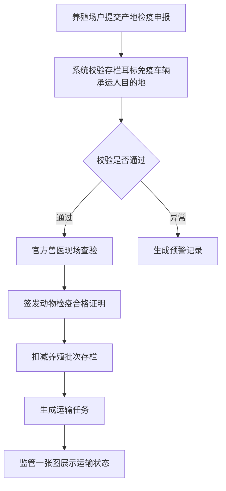
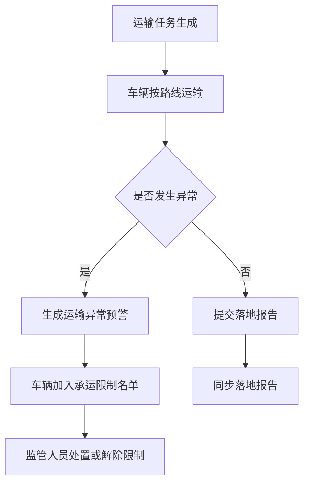
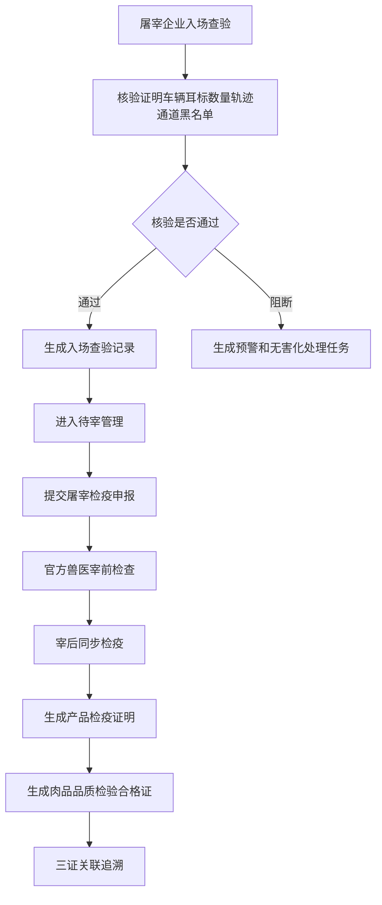
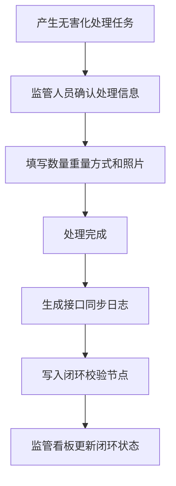

# 畜牧兽医管理分系统产品需求文档

## 1. 产品概述

畜牧兽医管理分系统面向养殖场户、官方兽医、屠宰企业和监管人员，围绕“产地检疫—运输监管—屠宰入场—屠宰检疫—产品出证—无害化处理—闭环校验”的监管链条，支撑动物从养殖场到屠宰场再到产品出证的全过程业务流转。

系统采用前端本地业务服务层承载数据读写、状态流转、业务校验、日志记录、预警生成和闭环追溯能力。页面不直接写死业务数据，统一通过 `mockApi`、Pinia 和状态机完成真实业务链路联动，刷新页面后业务数据通过 localStorage 保持。

## 2. 建设目标

1. 建立覆盖产地检疫、运输监管、屠宰检疫、产品出证、无害化处理的完整业务闭环。
2. 支撑四类业务角色按权限进入对应工作台，保障不同角色操作边界清晰。
3. 通过统一状态机控制申报、出证、运输、落地、入场、待宰、宰前、宰后、产品出证、无害化处理、三证关联等关键节点。
4. 对关键业务动作自动写入操作日志、预警记录、接口同步日志和闭环校验节点。
5. 提供监管看板、一张图、抽查、统计分析、同步日志和闭环校验总览，支撑监管人员快速掌握风险和链路完整性。
6. 将恢复初始数据、刷新业务数据等辅助工具收纳至右下角“AI助手”悬浮入口，主业务界面保持正式系统风格。

## 3. 用户角色与权限

| 角色 | 入口 | 核心权限 |
|------|------|----------|
| 养殖场户 | 登录页选择“养殖场户” | 提交产地检疫申报、查看申报详情、查看动物检疫合格证明和运输信息 |
| 官方兽医 | 登录页选择“官方兽医” | 审核产地检疫申报、完成现场查验、无纸化出证、办理屠宰检疫审核和产品出证 |
| 屠宰企业 | 登录页选择“屠宰企业” | 入场查验、待宰管理、提交屠宰检疫申报、自检结果填报 |
| 监管人员 | 登录页选择“监管人员” | 查看监管看板、调运监管一张图、证明抽查、落地报告抽查、统计分析、承运限制、无害化处理、证章管理、同步日志和闭环校验 |

## 4. 功能范围

### 4.1 角色入口与系统工作台

- 登录页提供四类角色入口。
- 登录后进入统一系统外壳，左侧展示当前角色可访问菜单。
- 顶部展示当前角色工作台名称、申报数量、证明数量和预警数量。
- 右下角提供“AI助手”悬浮入口，用于打开系统辅助工具面板。

### 4.2 养殖场户端

#### 4.2.1 产地检疫申报

- 选择养殖批次、动物种类、申报数量、承运车辆、承运人、目的地。
- 提交前校验：存栏数量、耳标号段、强制免疫、车辆备案、承运人备案、定位设备、目的地信息。
- 校验通过后形成产地检疫申报记录。
- 校验异常时生成预警记录并提示业务人员处理。

#### 4.2.2 申报详情与电子检疫证明

- 展示申报编号、动物种类、数量、启运地、目的地、车辆、承运人、状态。
- 展示动物检疫合格证明信息，包括证明编号、有效期、签发人、动物信息、承运信息。
- 展示运输任务和业务时间线，便于养殖场户跟踪后续流转。

### 4.3 官方兽医端

#### 4.3.1 产地检疫待办

- 展示待审核产地检疫申报。
- 支持按申报状态查看待办。
- 进入现场查验与无纸化出证页面办理审核。

#### 4.3.2 现场查验与无纸化出证

- 执行官方兽医身份核验、现场查验、拍照取证等步骤。
- 填写查验结果、取证照片数量和查验意见。
- 审核通过后生成动物检疫合格证明。
- 出证后自动扣减养殖批次存栏数量，生成运输任务、操作日志、同步日志和闭环节点。

#### 4.3.3 屠宰检疫审核与产品出证

- 查看屠宰检疫申报和待宰批次。
- 办理宰前检查、宰后同步检疫。
- 录入合格数量、不合格数量和产品重量。
- 不合格数量大于 0 时自动生成无害化处理任务。
- 生成动物产品检疫证明和肉品品质检验合格证。
- 完成动物检疫合格证明、动物产品检疫证明、肉品品质检验合格证三证关联。

### 4.4 屠宰企业端

#### 4.4.1 入场查验

- 支持输入车牌号或动物检疫合格证明编号查询。
- 执行车牌识别、证明有效性、指定通道、黑名单、运输轨迹、耳标一致性、数量一致性、启运地与耳标区划一致性等核验。
- 入场通过后生成入场查验记录，可进入待宰管理。
- 来源不明、证明无效、数量不一致、耳标不一致等关键异常自动阻断入场，并生成预警记录和无害化处理任务。

#### 4.4.2 待宰管理

- 展示入场通过后的待宰批次。
- 支持查看关联检疫证明、入场查验记录、动物种类和待宰数量。
- 为后续屠宰检疫申报和官方兽医审核提供数据基础。

#### 4.4.3 屠宰检疫申报

- 提交非洲猪瘟检测结果、违禁药物自检结果、待宰数量和申报材料。
- 形成屠宰检疫申报记录，进入官方兽医审核环节。

### 4.5 监管人员端

#### 4.5.1 检疫屠宰监管看板

- 展示申报、证明、运输、入场、产品证书、预警等关键指标。
- 展示从养殖场到屠宰场的全链路状态。
- 展示预警记录、操作日志、证明和产品流向。
- 展示无害化处理状态和闭环完成情况。

#### 4.5.2 调运监管一张图

- 展示运输任务、路线节点、车辆点位和车辆状态。
- 车辆状态分为正常车辆、异常车辆、限制车辆。
- 支持提交落地报告和标记运输异常。
- 运输异常后自动生成预警并加入承运限制名单。

#### 4.5.3 产地检疫证明抽查

- 支持按证明类型、用途、区域、动物种类、车牌号、官方兽医、出证时间、目的地、证明状态进行筛选。
- 展示检疫证明基础信息、承运信息和状态。

#### 4.5.4 落地报告抽查

- 查看运输任务、检疫证明、车辆轨迹、目的地一致性和落地时效。
- 落地报告状态包括待提交、已提交、超时未提交、异常。
- 支持识别轨迹偏离、未落地报告、未按目的地运输等异常类型。

#### 4.5.5 产地检疫统计分析

- 支持按出证时间、动物种类、用途、启运地、目的地、证明状态统计。
- 支持下钻至乡镇和养殖场。
- 提供导出按钮和统计图表。

#### 4.5.6 承运限制管理

- 查看限制原因、关联检疫证明、关联车辆、限制时间和处置记录。
- 支持解除承运限制。
- 解除后回写状态并记录处置日志。

#### 4.5.7 无害化处理任务

- 支持查看来源：养殖死亡申报、屠宰检疫不合格、入场异常。
- 支持上传处理照片、填写处理数量、处理重量和处理方式。
- 处理完成后回写闭环状态，生成同步日志和闭环节点。

#### 4.5.8 检疫证章管理

- 支持检疫标志和检疫证章的领用、发放、使用、回收、销毁记录。
- 产品检疫出证时关联证章使用记录。

#### 4.5.9 屠宰检疫统计分析

- 支持按日、月、年统计。
- 展示入场来源统计、省内省外来源、分畜种屠宰数量、检疫合格与不合格数量。
- 展示病害动物无害化处理数量和重量、检疫证明出证数量和产品重量。
- 提供导出按钮和图表展示。

#### 4.5.10 接口同步日志

- 每次产地检疫出证、运输落地、屠宰入场、产品检疫出证、无害化确认后生成同步日志。
- 同步目标包括动物检疫大数据系统、畜禽屠宰行业管理系统、无害化处理数据系统、省级畜牧数据仓。
- 展示同步状态、同步时间、业务编号、失败原因和重试按钮。

#### 4.5.11 检疫屠宰闭环校验总览

- 以时间轴展示养殖批次、免疫记录、产地检疫申报、动物检疫合格证明、运输任务、指定通道、落地报告、屠宰入场、非瘟检测、宰前检查、宰后检疫、产品检疫证明、肉品品质检验合格证、无害化处理、三证关联追溯。
- 每个节点展示数据来源、校验结果、操作人、操作时间和接口同步状态。
- 支持点击节点查看详情。
- 支持生成闭环校验报告弹窗。

## 5. 核心业务流程

### 5.1 产地检疫到运输监管

### 5.2 运输落地与承运限制

### 5.3 屠宰入场到产品出证

### 5.4 无害化处理与闭环校验

## 6. 状态流转要求

系统状态由统一状态机控制，关键状态包括：

- 产地检疫：草稿、已提交、产地审核中、产地审核通过、动物检疫合格证明已签发。
- 运输监管：运输中、待落地、已落地、超时未落地、落地异常、承运限制、限制解除。
- 屠宰入场：入场核验中、入场通过、入场阻断。
- 屠宰检疫：待宰、宰前检查完成、宰后检疫完成、屠宰申报已提交、屠宰审核中、屠宰审核通过。
- 产品出证：动物产品检疫证明已签发、肉品品质检验合格证已签发、三证已关联。
- 无害化处理：待处理、处理中、处理完成。

## 7. 数据与日志要求

每个关键业务动作必须形成对应数据沉淀：

| 数据类型 | 说明 |
|----------|------|
| OperationLog | 记录操作人、角色、动作、目标和时间 |
| AlertRecord | 记录风险级别、预警类型、预警内容、关联业务编号和处理状态 |
| SyncLog | 记录同步目标、同步状态、业务编号、同步时间、失败原因和重试次数 |
| ClosedLoopNode | 记录闭环节点、数据来源、校验结果、操作人、操作时间和同步状态 |

## 8. 页面清单

| 端 | 页面 | 路由 |
|----|------|------|
| 公共 | 登录/角色选择页 | `/login` |
| 养殖场户 | 产地检疫申报 | `/farmer/origin-apply` |
| 养殖场户 | 申报详情与电子检疫证明 | `/farmer/origin-detail/:id?` |
| 官方兽医 | 产地检疫待办 | `/vet/origin-todos` |
| 官方兽医 | 现场查验与无纸化出证 | `/vet/origin-inspection/:id` |
| 官方兽医 | 屠宰检疫审核与产品出证 | `/vet/slaughter-audit` |
| 屠宰企业 | 入场查验 | `/slaughter/entry-check` |
| 屠宰企业 | 待宰管理 | `/slaughter/waiting-slaughter` |
| 屠宰企业 | 屠宰检疫申报 | `/slaughter/slaughter-apply` |
| 监管人员 | 检疫屠宰监管看板 | `/regulator/dashboard` |
| 监管人员 | 调运监管一张图 | `/regulator/transport-map` |
| 监管人员 | 产地检疫证明抽查 | `/regulator/certificate-spot-check` |
| 监管人员 | 落地报告抽查 | `/regulator/landing-report-spot-check` |
| 监管人员 | 产地检疫统计分析 | `/regulator/origin-statistics` |
| 监管人员 | 承运限制管理 | `/regulator/carrier-restrictions` |
| 监管人员 | 无害化处理任务 | `/regulator/harmless-treatment` |
| 监管人员 | 检疫证章管理 | `/regulator/seal-management` |
| 监管人员 | 屠宰检疫统计分析 | `/regulator/slaughter-statistics` |
| 监管人员 | 接口同步日志 | `/regulator/sync-logs` |
| 监管人员 | 检疫屠宰闭环校验总览 | `/regulator/closed-loop` |

## 9. 界面与交互要求

1. 系统整体采用正式业务系统表达，不出现弱化真实系统感的旧版文案。
2. 主导航只保留业务功能菜单，不展示恢复数据等辅助操作。
3. “AI助手”作为右下角悬浮入口，承载刷新业务数据、恢复初始数据、查看闭环校验等辅助功能。
4. 关键业务操作使用绿色按钮，风险操作使用红色或橙色按钮。
5. 监管页面以卡片、表格、状态标签、时间轴、指标卡、一张图等形式呈现。
6. 桌面端优先适配 1366px 以上分辨率，窄屏下内容区单列展示。

## 10. 验收标准

1. 四类角色均可登录并进入对应工作台。
2. 产地检疫申报、审核、出证、运输任务生成、落地报告、运输异常、承运限制能够完整流转。
3. 入场查验能够完成多项核验，异常场景能够阻断并生成预警。
4. 屠宰检疫能够完成待宰、宰前、宰后、产品出证、肉品品质证书和三证关联。
5. 无害化处理任务能够确认完成，并回写监管看板和闭环校验总览。
6. 证章管理、统计分析、同步日志、闭环校验总览页面可正常访问和展示数据。
7. 关键业务动作写入 OperationLog、AlertRecord、SyncLog 和 ClosedLoopNode。
8. 前端刷新后业务数据不丢失。
9. 系统界面不出现弱化真实系统感的旧文案。
10. 测试、类型检查、代码规范检查和生产构建均通过。
