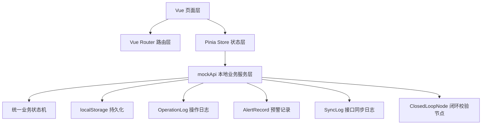
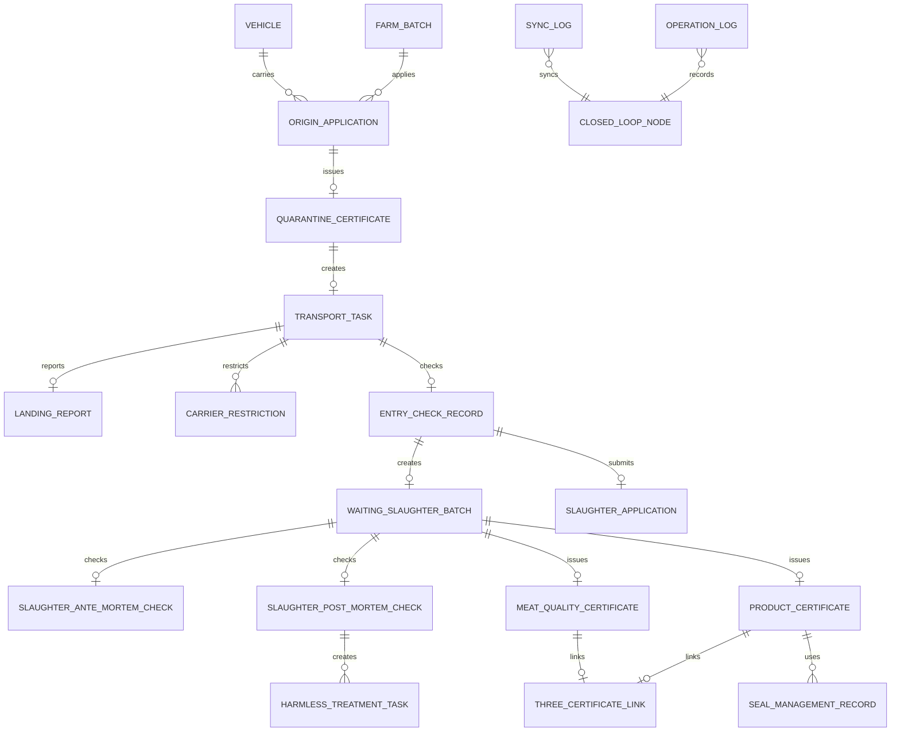

# 畜牧兽医管理分系统技术架构文档

## 1. 架构概述

畜牧兽医管理分系统采用 Vue 3 + TypeScript + Vite 构建单页应用。系统不接入真实后端，由前端本地业务服务层 `mockApi` 统一承载业务数据读写、业务校验、状态流转、日志记录、预警生成、同步日志和闭环校验节点写入。页面层不直接写死业务数据，只通过 Pinia Store 调用业务动作。

系统数据通过 localStorage 持久化，刷新页面后业务数据保持。测试环境中提供内存存储兜底，保障 Vitest 可稳定执行。



## 2. 技术栈

| 分类 | 技术 | 用途 |
|------|------|------|
| 构建工具 | Vite | 开发服务、生产构建、资源打包 |
| 前端框架 | Vue 3 | 单页应用和组合式 API |
| 类型系统 | TypeScript | 业务模型、接口、状态类型约束 |
| UI 组件 | Element Plus | 表单、表格、标签、弹窗、按钮、时间轴等组件 |
| 状态管理 | Pinia | 全局业务数据和角色会话管理 |
| 路由 | Vue Router | 页面路由、角色访问控制 |
| 数据持久化 | localStorage | 本地业务数据持久化 |
| 测试 | Vitest | 状态机和业务流转测试 |
| 部署 | GitHub Pages + GitHub Actions | 静态站点构建与发布 |

## 3. 分层设计

### 3.1 页面层

页面位于 `src/views/**`，按角色和业务域划分。页面负责表单交互、数据展示、按钮触发和结果提示，不直接修改业务数据。

### 3.2 布局层

`src/layouts/AppShell.vue` 提供统一系统外壳，包括左侧导航、顶部角色信息、业务统计和右下角“AI助手”悬浮工具入口。

### 3.3 状态层

`src/stores/app.ts` 通过 Pinia 管理当前登录角色、业务数据、加载状态和页面动作。Store 是页面调用业务能力的统一入口。

### 3.4 本地业务服务层

`src/api/mockApi.ts` 封装全部业务读写方法，包括申报、审核、出证、运输、落地、入场、待宰、宰前、宰后、产品证书、肉品品质证书、三证关联、无害化处理、承运限制、同步日志重试和恢复初始数据。

### 3.5 领域模型层

`src/domain/models.ts` 定义角色、业务状态、输入参数、业务实体、日志、预警、同步日志和闭环节点类型。

### 3.6 状态机层

`src/domain/stateMachine.ts` 定义状态流转关系、状态中文名、状态标签类型、状态流转校验和状态转移方法。所有关键业务动作必须经过状态机判断。

### 3.7 初始数据层

`src/domain/seed.ts` 定义初始业务数据和四类角色会话信息。

## 4. 路由设计

| 路由 | 页面 | 角色 |
|------|------|------|
| `/` | 重定向到登录页 | 全部 |
| `/login` | 登录/角色选择页 | 全部 |
| `/farmer/origin-apply` | 产地检疫申报 | 养殖场户 |
| `/farmer/origin-detail/:id?` | 申报详情与电子检疫证明 | 养殖场户 |
| `/vet/origin-todos` | 产地检疫待办 | 官方兽医 |
| `/vet/origin-inspection/:id` | 现场查验与无纸化出证 | 官方兽医 |
| `/vet/slaughter-audit` | 屠宰检疫审核与产品出证 | 官方兽医 |
| `/slaughter/entry-check` | 入场查验 | 屠宰企业 |
| `/slaughter/waiting-slaughter` | 待宰管理 | 屠宰企业 |
| `/slaughter/slaughter-apply` | 屠宰检疫申报 | 屠宰企业 |
| `/regulator/dashboard` | 检疫屠宰监管看板 | 监管人员 |
| `/regulator/transport-map` | 调运监管一张图 | 监管人员 |
| `/regulator/certificate-spot-check` | 产地检疫证明抽查 | 监管人员 |
| `/regulator/landing-report-spot-check` | 落地报告抽查 | 监管人员 |
| `/regulator/origin-statistics` | 产地检疫统计分析 | 监管人员 |
| `/regulator/carrier-restrictions` | 承运限制管理 | 监管人员 |
| `/regulator/harmless-treatment` | 无害化处理任务 | 监管人员 |
| `/regulator/seal-management` | 检疫证章管理 | 监管人员 |
| `/regulator/slaughter-statistics` | 屠宰检疫统计分析 | 监管人员 |
| `/regulator/sync-logs` | 接口同步日志 | 监管人员 |
| `/regulator/closed-loop` | 检疫屠宰闭环校验总览 | 监管人员 |

路由守卫逻辑：

1. 访问业务页面前先加载会话和业务数据。
2. 未登录访问业务页面时跳转到 `/login`。
3. 已登录角色访问非本角色页面时跳转到当前角色首页。

## 5. 核心 API 设计

`mockApi` 所有方法返回 Promise，保持异步接口形态。

```typescript
export interface MockApi {
  getSession(): Promise<UserSession | undefined>
  login(role: UserRole): Promise<UserSession>
  logout(): Promise<void>
  getBootstrapData(): Promise<AppData>
  restoreInitialData(): Promise<AppData>

  submitOriginApplication(input: OriginApplicationInput): Promise<OriginQuarantineApplication>
  approveOriginApplication(id: string, input: OriginInspectionInput): Promise<QuarantineCertificate>

  submitLandingReport(input: LandingReportInput): Promise<LandingReport>
  markTransportException(input: TransportExceptionInput): Promise<TransportTask>
  releaseCarrierRestriction(id: string, disposalRemark: string): Promise<CarrierRestriction>

  performEntryCheck(input: EntryCheckInput): Promise<EntryCheckRecord>
  createWaitingSlaughterBatch(entryCheckId: string): Promise<WaitingSlaughterBatch>
  submitSlaughterApplication(input: SlaughterApplicationInput): Promise<SlaughterQuarantineApplication>
  approveSlaughterApplication(id: string, input: SlaughterAuditInput): Promise<ProductCertificate>

  submitAnteMortemCheck(input: AnteMortemInput): Promise<SlaughterAnteMortemCheck>
  submitPostMortemCheck(input: PostMortemInput): Promise<SlaughterPostMortemCheck>
  issueProductCertificate(input: ProductCertificateInput): Promise<ProductCertificate>
  issueMeatQualityCertificate(input: MeatQualityCertificateInput): Promise<MeatQualityCertificate>
  linkThreeCertificates(waitingBatchId: string): Promise<ThreeCertificateLink>

  createHarmlessTreatmentTask(input: HarmlessTaskInput): Promise<HarmlessTreatmentTask>
  completeHarmlessTreatment(input: CompleteHarmlessInput): Promise<HarmlessTreatmentTask>

  retrySyncLog(id: string): Promise<SyncLog>
}
```

## 6. 数据模型设计

### 6.1 核心实体关系



### 6.2 主要业务模型

| 模型 | 说明 |
|------|------|
| UserSession | 当前角色会话和角色首页 |
| FarmBatch | 养殖批次、动物种类、存栏、免疫、耳标号段、位置 |
| Vehicle | 承运车辆、承运人、备案状态、黑名单状态、指定通道 |
| OriginQuarantineApplication | 产地检疫申报记录 |
| QuarantineCertificate | 动物检疫合格证明 |
| TransportTask | 运输任务、路线、车辆状态和到达状态 |
| LandingReport | 落地报告、实际目的地、是否超时、异常类型 |
| CarrierRestriction | 承运限制、关联车辆、证明、运输任务和处置记录 |
| EntryCheckRecord | 屠宰入场查验记录和核验明细 |
| WaitingSlaughterBatch | 待宰批次 |
| SlaughterQuarantineApplication | 屠宰检疫申报 |
| SlaughterAnteMortemCheck | 宰前检查 |
| SlaughterPostMortemCheck | 宰后检疫 |
| ProductCertificate | 动物产品检疫证明 |
| MeatQualityCertificate | 肉品品质检验合格证 |
| ThreeCertificateLink | 动物检疫合格证明、动物产品检疫证明、肉品品质检验合格证三证关联 |
| HarmlessTreatmentTask | 无害化处理任务 |
| SealManagementRecord | 检疫标志和检疫证章管理记录 |
| SyncLog | 接口同步日志 |
| ClosedLoopNode | 闭环校验节点 |
| OperationLog | 操作日志 |
| AlertRecord | 预警记录 |

## 7. 状态机设计

`BusinessStatus` 覆盖以下业务状态：

```typescript
export type BusinessStatus =
  | 'draft'
  | 'submitted'
  | 'origin_reviewing'
  | 'origin_approved'
  | 'certificate_issued'
  | 'transporting'
  | 'landing_pending'
  | 'landing_submitted'
  | 'landing_overdue'
  | 'landing_exception'
  | 'carrier_restricted'
  | 'carrier_released'
  | 'arrived'
  | 'entry_checking'
  | 'entry_passed'
  | 'entry_rejected'
  | 'waiting_slaughter'
  | 'ante_mortem_checked'
  | 'post_mortem_checked'
  | 'slaughter_submitted'
  | 'slaughter_reviewing'
  | 'slaughter_approved'
  | 'product_certificate_issued'
  | 'meat_quality_certificate_issued'
  | 'three_cert_linked'
  | 'harmless_pending'
  | 'harmless_processing'
  | 'harmless_completed'
```

状态机核心方法：

```typescript
canTransition(from: BusinessStatus, to: BusinessStatus): boolean
transitionStatus(from: BusinessStatus, to: BusinessStatus): BusinessStatus
```

状态机职责：

1. 控制业务状态只能按合法路径流转。
2. 为页面状态标签提供中文状态名和标签类型。
3. 在非法流转时抛出错误，避免业务数据进入不一致状态。
4. 支撑产地检疫、运输、入场、屠宰检疫、产品出证、无害化处理等多条链路。

## 8. 关键业务写入规则

### 8.1 产地检疫出证

- 产地申报状态进入证明签发节点。
- 扣减养殖批次存栏。
- 生成动物检疫合格证明。
- 生成运输任务。
- 写入操作日志、同步日志和闭环节点。

### 8.2 运输落地

- 根据实际目的地判断是否按目的地到达。
- 根据时效判断是否超时落地。
- 正常落地时写入落地报告、同步日志和闭环节点。
- 异常落地时写入预警并可触发承运限制。

### 8.3 运输异常

- 更新运输任务异常状态。
- 写入轨迹偏离、未落地报告或未按目的地运输预警。
- 自动生成承运限制记录。
- 写入操作日志和闭环节点。

### 8.4 屠宰入场

- 核验证明有效性、车牌、通道、黑名单、轨迹、耳标、数量、区划一致性。
- 通过时生成入场查验记录并允许进入待宰管理。
- 阻断时生成预警记录，并按异常类型创建无害化处理任务。
- 写入同步日志和闭环节点。

### 8.5 屠宰检疫与产品出证

- 待宰批次进入宰前检查、宰后检疫。
- 宰后检疫记录合格数量、不合格数量和产品重量。
- 不合格数量大于 0 时生成无害化处理任务。
- 产品出证时生成动物产品检疫证明。
- 肉品品质检验合格后生成肉品品质检验合格证。
- 三证关联后形成完整追溯链条。

### 8.6 无害化处理

- 任务来源包括养殖死亡申报、屠宰检疫不合格、入场异常。
- 完成处理后记录处理数量、重量、方式和照片。
- 更新任务状态为处理完成。
- 写入操作日志、同步日志和闭环节点。

## 9. 文件职责

| 文件 | 职责 |
|------|------|
| `src/domain/models.ts` | 角色、状态、输入参数、业务实体和日志模型定义 |
| `src/domain/stateMachine.ts` | 统一业务状态机、状态中文名、状态标签类型和状态流转校验 |
| `src/domain/seed.ts` | 初始化业务数据和角色会话 |
| `src/api/mockApi.ts` | 本地业务服务层，统一处理数据读写、校验、状态流转、日志、预警和同步记录 |
| `src/stores/app.ts` | Pinia 全局状态、会话加载和页面动作封装 |
| `src/router/index.ts` | 路由配置、角色访问控制和默认跳转 |
| `src/layouts/AppShell.vue` | 统一布局、导航、角色信息、业务统计和 AI助手悬浮入口 |
| `src/views/**` | 各角色业务页面，通过 Store 间接调用业务服务 |
| `src/style.css` | 全局主题、布局、卡片、看板、一张图和 AI助手样式 |
| `src/tests/*.test.ts` | 状态机、核心闭环和扩展业务流转测试 |

## 10. AI助手悬浮入口设计

AI助手位于系统右下角，作为辅助工具收纳入口，不参与核心业务流程权限控制。

当前包含功能：

1. 刷新业务数据：重新从本地业务服务层读取最新业务数据。
2. 恢复初始数据：将业务数据恢复为初始化状态。
3. 查看闭环校验：快速跳转到检疫屠宰闭环校验总览。

设计原则：

- 主业务导航不展示辅助工具。
- 辅助工具集中收纳，降低对正式业务系统观感的影响。
- 文案保持正式系统口径。

## 11. 数据持久化设计

- 业务数据存储键：`animal-vet-system-data`。
- 会话数据存储键：`animal-vet-system-session`。
- 读数据时执行结构补齐，确保旧数据能兼容新增字段。
- 恢复初始数据时重新写入 `createSeedData()` 生成的数据。
- 测试环境无 localStorage 时使用内存 Map 存储兜底。

## 12. 测试与验证策略

### 12.1 自动化测试

| 命令 | 作用 |
|------|------|
| `npm run test` | 执行 Vitest 测试 |
| `npm run check` | 执行 TypeScript 类型检查 |
| `npm run lint` | 执行 ESLint 代码规范检查 |
| `npm run build` | 执行生产构建 |

### 12.2 测试覆盖范围

- 状态机合法流转和非法流转。
- 产地申报、出证、运输、入场、屠宰申报、产品出证主链路。
- 落地报告、运输异常、承运限制、屠宰全过程、无害化处理、同步日志和闭环节点扩展链路。

### 12.3 当前验证结果

当前版本已通过：

- `npm run test`
- `npm run check`
- `npm run lint`
- `npm run build`

## 13. 构建与部署设计

### 13.1 Vite 配置

GitHub Pages 部署路径：

```typescript
base: '/Animal-Husbandry-and-Veterinary-Management/'
```

### 13.2 GitHub Actions

`.github/workflows/deploy.yml` 负责在 `main` 分支推送后执行：

1. Checkout。
2. Setup Node 20。
3. `npm ci` 安装依赖。
4. `npm run test`。
5. `npm run check`。
6. `npm run lint`。
7. `npm run build`。
8. 上传 `dist` 构建产物。
9. 发布到 GitHub Pages。

## 14. 质量约束

1. 页面不得直接写死业务流转数据。
2. 业务状态必须由统一状态机控制。
3. 所有关键业务动作必须写入对应日志或闭环记录。
4. 角色访问必须通过路由守卫控制。
5. 业务文案保持正式系统表达，不使用弱化真实系统感的旧口径。
6. 新增业务模型必须同步更新 TypeScript 类型、初始数据、Store 动作、测试用例和相关页面。
