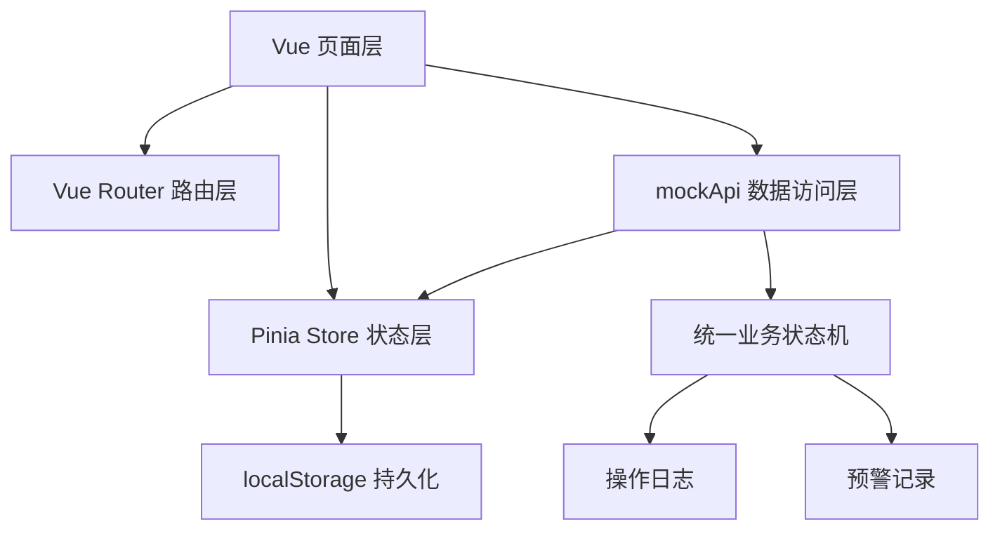
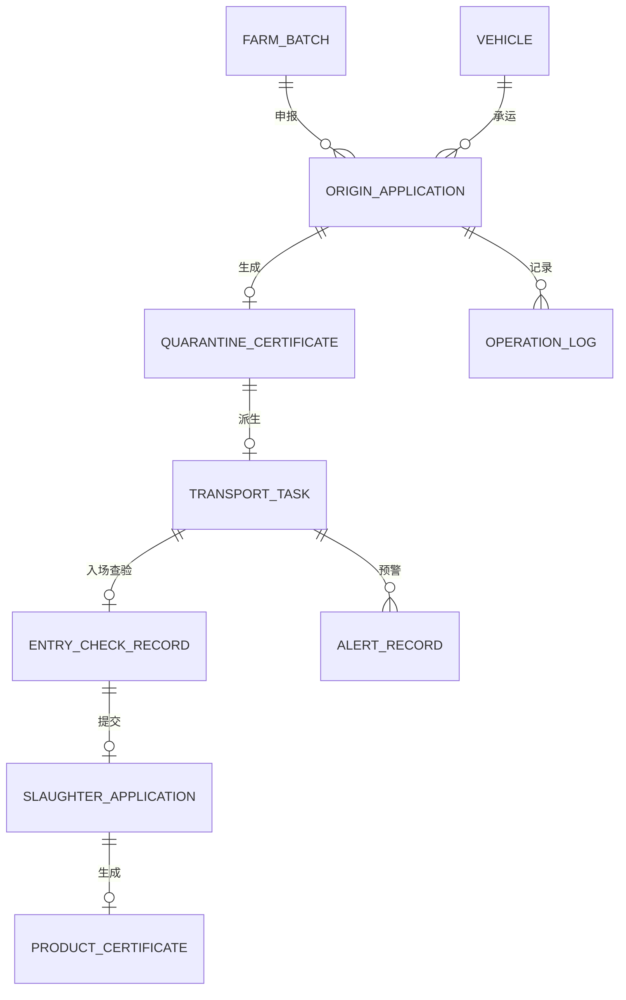

# 畜牧兽医管理分系统演示 Demo 技术架构文档

## 1. 架构设计

系统采用纯前端单页应用架构，不接入真实后端。页面层仅调用 mockApi，mockApi 负责业务校验、状态流转、日志写入和预警生成。Pinia 作为全局状态容器，并通过 localStorage 持久化业务数据，刷新页面后业务数据不丢失。



## 2. 技术说明

- 前端：Vue 3 + TypeScript + Vite
- UI 组件：Element Plus
- 状态管理：Pinia
- 路由：Vue Router
- 数据持久化：localStorage
- 后端：无真实后端，使用 `src/api/mockApi.ts` 封装全部读写操作
- 测试：Vitest，重点覆盖状态机和 mockApi 业务流转
- 构建：Vite 默认构建流程

## 3. 路由定义

| 路由 | 页面 | 角色 |
|------|------|------|
| `/login` | 登录/角色选择页 | 全部 |
| `/farmer/origin-apply` | 产地检疫申报页面 | 养殖场户 |
| `/farmer/origin-detail/:id?` | 申报详情与电子检疫证明页面 | 养殖场户 |
| `/vet/origin-todos` | 产地检疫待办页面 | 官方兽医 |
| `/vet/origin-inspection/:id` | 现场查验与无纸化出证页面 | 官方兽医 |
| `/regulator/transport-map` | 调运监管一张图页面 | 监管人员 |
| `/slaughter/entry-check` | 入场查验页面 | 屠宰企业 |
| `/slaughter/slaughter-apply` | 屠宰检疫申报页面 | 屠宰企业 |
| `/vet/slaughter-audit` | 屠宰检疫审核与产品出证页面 | 官方兽医 |
| `/regulator/dashboard` | 检疫屠宰监管看板页面 | 监管人员 |
| `/` | 默认重定向到登录页 | 全部 |

## 4. API 定义

mockApi 所有方法返回 Promise，模拟真实异步接口。

```typescript
export type UserRole = 'farmer' | 'vet' | 'slaughter' | 'regulator'

export interface MockApi {
  login(role: UserRole): Promise<UserSession>
  getBootstrapData(): Promise<AppData>
  submitOriginApplication(input: OriginApplicationInput): Promise<OriginQuarantineApplication>
  getOriginApplications(): Promise<OriginQuarantineApplication[]>
  getOriginApplication(id: string): Promise<OriginQuarantineApplication | undefined>
  approveOriginApplication(id: string, input: OriginInspectionInput): Promise<QuarantineCertificate>
  getTransportTasks(): Promise<TransportTask[]>
  performEntryCheck(input: EntryCheckInput): Promise<EntryCheckRecord>
  submitSlaughterApplication(input: SlaughterApplicationInput): Promise<SlaughterQuarantineApplication>
  approveSlaughterApplication(id: string, input: SlaughterAuditInput): Promise<ProductCertificate>
  getAlerts(): Promise<AlertRecord[]>
  getLogs(): Promise<OperationLog[]>
  resetDemoData(): Promise<AppData>
}
```

## 5. 数据模型

### 5.1 数据模型定义



### 5.2 TypeScript 数据定义

```typescript
export type UserRole = 'farmer' | 'vet' | 'slaughter' | 'regulator'

export type BusinessStatus =
  | 'draft'
  | 'submitted'
  | 'origin_reviewing'
  | 'origin_approved'
  | 'certificate_issued'
  | 'transporting'
  | 'arrived'
  | 'entry_checking'
  | 'entry_passed'
  | 'entry_rejected'
  | 'slaughter_submitted'
  | 'slaughter_reviewing'
  | 'slaughter_approved'
  | 'product_certificate_issued'

export interface FarmBatch {
  id: string
  farmName: string
  animalType: string
  breed: string
  stock: number
  immuneQualified: boolean
  earTagPrefix: string
  earTagStart: number
  earTagEnd: number
  location: string
}

export interface Vehicle {
  id: string
  plateNo: string
  carrier: string
  registered: boolean
  blacklisted: boolean
  channel: string
}

export interface OriginQuarantineApplication {
  id: string
  applicationNo: string
  batchId: string
  animalType: string
  quantity: number
  destination: string
  vehicleId: string
  carrier: string
  status: BusinessStatus
  validationResults: ValidationResult[]
  createdAt: string
  updatedAt: string
}

export interface QuarantineCertificate {
  id: string
  certificateNo: string
  applicationId: string
  validFrom: string
  validTo: string
  issuedBy: string
  animalType: string
  quantity: number
  origin: string
  destination: string
  vehiclePlateNo: string
}

export interface TransportTask {
  id: string
  certificateId: string
  plateNo: string
  status: BusinessStatus
  route: RoutePoint[]
  hasDeviation: boolean
  startedAt: string
  arrivedAt?: string
}

export interface EntryCheckRecord {
  id: string
  certificateId: string
  plateNo: string
  status: BusinessStatus
  checks: ValidationResult[]
  checkedAt: string
}

export interface SlaughterQuarantineApplication {
  id: string
  entryCheckId: string
  applicationNo: string
  quantity: number
  africanSwineFeverResult: 'negative' | 'positive'
  bannedDrugResult: 'negative' | 'positive'
  status: BusinessStatus
  createdAt: string
}

export interface ProductCertificate {
  id: string
  certificateNo: string
  slaughterApplicationId: string
  productName: string
  weight: number
  issuedBy: string
  issuedAt: string
}

export interface OperationLog {
  id: string
  actor: string
  role: UserRole
  action: string
  target: string
  createdAt: string
}

export interface AlertRecord {
  id: string
  level: 'info' | 'warning' | 'danger'
  type: string
  message: string
  relatedId: string
  resolved: boolean
  createdAt: string
}
```

## 6. 状态机设计

状态机集中定义在 `src/domain/stateMachine.ts`，mockApi 每次业务动作都调用状态机判断是否允许流转。

```typescript
export const statusTransitions: Record<BusinessStatus, BusinessStatus[]> = {
  draft: ['submitted'],
  submitted: ['origin_reviewing'],
  origin_reviewing: ['origin_approved'],
  origin_approved: ['certificate_issued'],
  certificate_issued: ['transporting'],
  transporting: ['arrived'],
  arrived: ['entry_checking'],
  entry_checking: ['entry_passed', 'entry_rejected'],
  entry_passed: ['slaughter_submitted'],
  entry_rejected: [],
  slaughter_submitted: ['slaughter_reviewing'],
  slaughter_reviewing: ['slaughter_approved'],
  slaughter_approved: ['product_certificate_issued'],
  product_certificate_issued: []
}
```

## 7. 文件职责

| 文件 | 职责 |
|------|------|
| `src/domain/models.ts` | 定义角色、状态、业务实体和接口类型 |
| `src/domain/stateMachine.ts` | 统一业务状态机、状态标签、状态流转校验 |
| `src/domain/seed.ts` | 初始化演示种子数据 |
| `src/api/mockApi.ts` | 统一数据读写、业务校验、状态流转、日志和预警生成 |
| `src/stores/app.ts` | Pinia 全局状态、localStorage 持久化、页面调用动作 |
| `src/router/index.ts` | 路由配置和角色入口跳转 |
| `src/layouts/AppShell.vue` | 统一布局、导航、角色信息、重置数据入口 |
| `src/views/**` | 各角色业务页面，只通过 store 或 mockApi 间接获取数据 |
| `src/styles/main.css` | 全局主题、布局、看板和卡片样式 |

## 8. 验证策略

- 使用 Vitest 测试状态机合法和非法流转。
- 使用 Vitest 测试 mockApi 的关键闭环：提交产地申报、出证扣减存栏、生成运输任务、入场查验、屠宰申报、产品出证。
- 使用 TypeScript 编译检查页面和数据模型类型一致性。
- 使用 Vite 构建验证最终 Demo 可打包。
